  

  

  
  

---

## 🚀 About Me

Business and strategy consultant, builder and entrepreneur working at the intersection of **product design, AI and automation**. I design and ship AI-powered tools, from **multi-agent systems** and **LLM workflows** to **full-stack web apps**.

- 🎓 Currently doing my **MSc in Analytics & AI (MAAI)** at **ESMT Berlin**
- 🛠️ Building my own products under **PeakLab**
- ⚡ Turning ideas into working prototypes, fast

---

## 🧭 Timeline

  

---

## 🧠 Tech Stack

  

  
  
  
  
  
  

---

## 🔥 Featured Projects

<table>
  <tr>
    <td width="50%" valign="top">
      <h3>👥 Peak Staff</h3>
      
Shift and allocation management for clubs and associations, with role-based permissions.

      

        
      

      <a href="https://github.com/pceventtech/Association-Tool">→ View repo</a>
    </td>
    <td width="50%" valign="top">
      <h3>♟️ PeakChess</h3>
      
A chess improvement platform built to help players train smarter.

      

        
      

      <a href="YOUR_REPO_LINK">→ View repo</a>
    </td>
  </tr>
</table>

---

## 📫 Let's Connect

  

